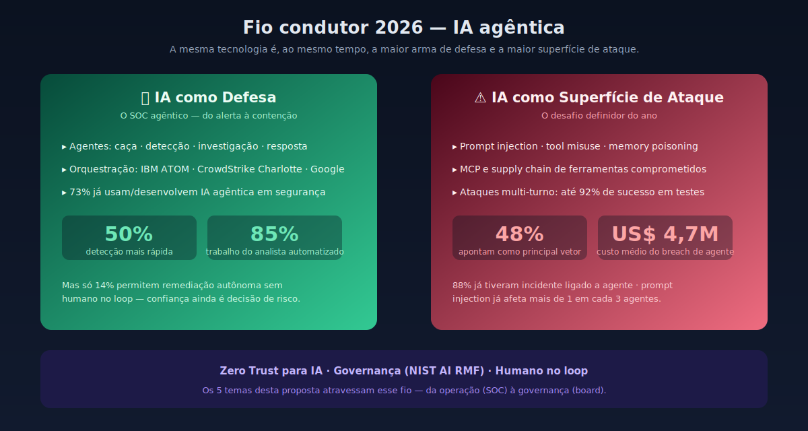
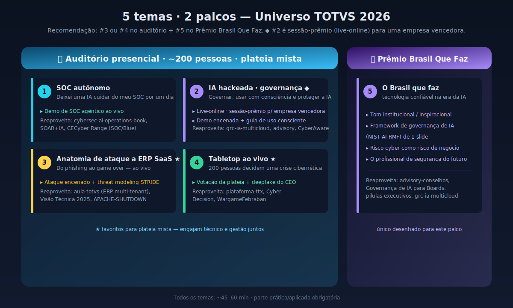
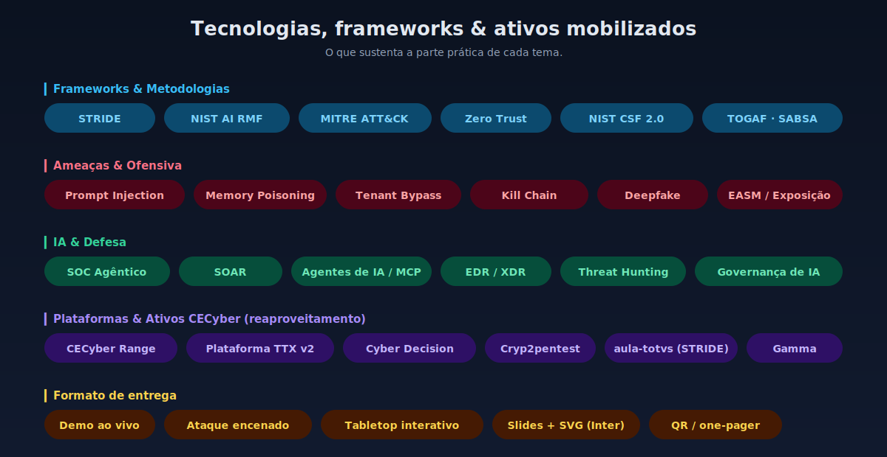

# Palestras — Universo TOTVS 2026

Proposta de temas para dois momentos de palestra no **Universo TOTVS 2026**, elaborada por **Almir Meira Alves (CECyber)**.


**Tecnologias & frameworks:**


## Fio condutor 2026 — IA agêntica



Em 2026 a **IA agêntica** virou, ao mesmo tempo, a maior arma de defesa e a maior superfície de ataque:

- 48% dos profissionais apontam IA agêntica como o **principal vetor de ataque**.
- 73% das empresas já **usam ou desenvolvem** IA agêntica na função de segurança.
- Custo médio de breach ligado a agente ≈ **US$ 4,7 milhões**.
- Só **14%** permitem remediação autônoma sem humano no loop; **88%** já tiveram incidente ligado a agente.

## Contexto

- **Momento 1 — Auditório presencial:** ~200 pessoas, plateia **mista** (engenharia/arquitetura de software, TI e gestão). Pede teatro técnico e mão na massa.
- **Momento 2 — Prêmio Brasil Que Faz:** palco institucional/inspiracional. Pede história, impacto e visão.
- **Duração:** ~45–60 min por momento.
- **Assinatura do palestrante:** toda palestra tem uma **parte prática e aplicada** (demo ao vivo, ataque encenado ou simulação interativa).

O organizador solicitou **4 temas**; entregamos **5** para dar margem de escolha. É possível (e recomendado) **reaproveitar** ativos do portfólio CECyber.

## Os 5 temas



| # | Título | Palco recomendado | Parte prática |
|---|--------|-------------------|---------------|
| 1 | Deixei uma IA cuidar do meu SOC por um dia | Auditório (técnico) | Demo de SOC agêntico ao vivo |
| 2 | A IA que você contratou também pode ser hackeada — governando IA corporativa com consciência | Prêmio Brasil Que Faz (sessão-prêmio, empresa vencedora · live-online) | Demo encenada + governança + guia de uso consciente |
| 3 | Anatomia de um ataque a um ERP na nuvem — ao vivo | Auditório (mista) | Ataque encenado + threat modeling |
| 4 | 200 pessoas, uma crise cibernética, uma decisão | Auditório (mista) | Tabletop com votação ao vivo |
| 5 | O Brasil que faz tecnologia confiável na era da IA | Prêmio Brasil Que Faz | Framework de governança aplicável |

**Recomendação de combinação:** #3 ou #4 no auditório (engajam plateia mista) + #5 no Prêmio Brasil Que Faz (palco institucional). O tema **#2** foi ajustado, a pedido do cliente, para a **sessão-prêmio dedicada a uma empresa vencedora do Brasil Que Faz** — formato **live-online**, público **não técnico** de uma única empresa, focado em **governança, segurança e uso consciente de IA** (mantendo o gancho "pode ser hackeada"). O #1 permanece como alternativa técnica de IA para o auditório.

## One-pagers

- [01 — O SOC Autônomo](one-pagers/01-soc-autonomo.md)
- [02 — A IA hackeada: governança e uso consciente de IA (sessão-prêmio Brasil Que Faz · live-online)](one-pagers/02-ia-hackeada.md)
- [03 — Anatomia de um ataque a um ERP SaaS](one-pagers/03-anatomia-ataque-erp.md)
- [04 — Tabletop ao vivo](one-pagers/04-tabletop-ao-vivo.md)
- [05 — O Brasil que faz tecnologia confiável (Prêmio Brasil Que Faz)](one-pagers/05-brasil-que-faz.md)

## Tecnologias, frameworks & ativos mobilizados



| Categoria | Itens |
|-----------|-------|
| **Frameworks & Metodologias** | STRIDE · NIST AI RMF · MITRE ATT&CK · Zero Trust · NIST CSF 2.0 · TOGAF/SABSA |
| **Ameaças & Ofensiva** | Prompt Injection · Memory Poisoning · Tenant Bypass · Kill Chain · Deepfake · EASM |
| **IA & Defesa** | SOC Agêntico · SOAR · Agentes de IA/MCP · EDR/XDR · Threat Hunting · Governança de IA |
| **Plataformas & Ativos CECyber** | CECyber Range · Plataforma TTX v2 · Cyber Decision · Cryp2pentest · aula-totvs (STRIDE) · Gamma |
| **Formato de entrega** | Demo ao vivo · Ataque encenado · Tabletop interativo · Slides + SVG · QR/one-pager |

## Estrutura do repositório

```
palestras-universo-totvs-2026/
├── README.md                          # visão geral, fio condutor, badges e índice
├── assets/
│   └── diagramas/                     # SVGs (paleta canônica CECyber, fonte Inter)
│       ├── 01-fio-condutor-2026.svg   # IA agêntica: defesa × superfície de ataque
│       ├── 02-mapa-temas.svg          # 5 temas mapeados nos 2 palcos
│       └── 03-tech-badges.svg         # tecnologias, frameworks e ativos
└── one-pagers/                        # 1 documento detalhado por tema (agenda 45–60 min)
    ├── 01-soc-autonomo.md
    ├── 02-ia-hackeada.md
    ├── 03-anatomia-ataque-erp.md
    ├── 04-tabletop-ao-vivo.md
    └── 05-brasil-que-faz.md
```

## Histórico com o Universo TOTVS

Já entregues em edições anteriores (base de reaproveitamento e evolução):

- *Introdução à Análise e Gestão de Vulnerabilidades + EASM* (Universo TOTVS 2025)
- *Visão Técnica de um Ataque Cibernético* (Universo TOTVS 2025)
- *Arquitetura de Segurança aplicada a Software* (live interna TOTVS, mai/2026)

## Fontes do cenário 2026

- [Dark Reading — 2026: The Year Agentic AI Becomes the Attack-Surface Poster Child](https://www.darkreading.com/threat-intelligence/2026-agentic-ai-attack-surface-poster-child)
- [Cloud Security Alliance — State of AI Cybersecurity 2026](https://cloudsecurityalliance.org/articles/the-state-of-ai-cybersecurity-2026-unveiling-insights-from-over-1-500-security-leaders)
- [Fortinet — Cybersecurity trends 2026](https://www.fortinet.com/resources/cyberglossary/cybersecurity-trends-2026)
- [Kiteworks — Agentic AI Attack Surface 2026](https://www.kiteworks.com/cybersecurity-risk-management/agentic-ai-attack-surface-enterprise-security-2026/)
- [BigAiAgent — The Agentic SOC Era Begins](https://bigaiagent.tech/ai-agents-cybersecurity-2026-agentic-soc/)
