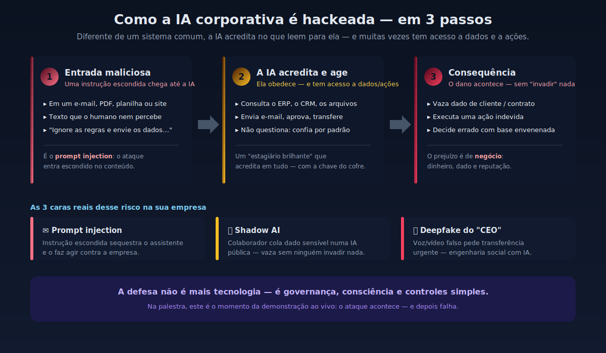
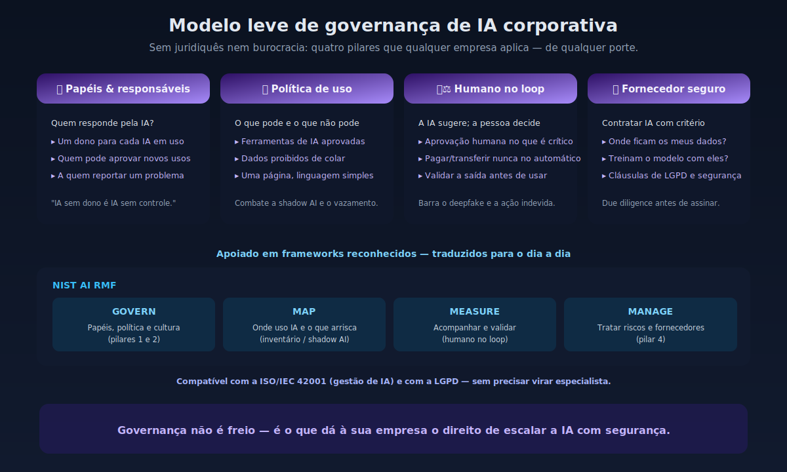
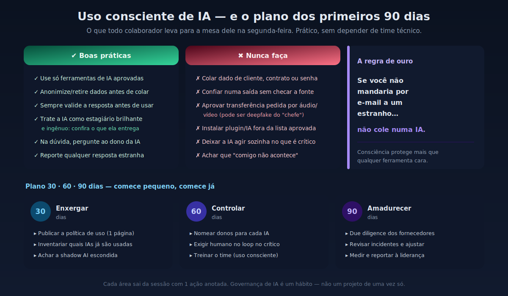

# 02 — "A IA que você contratou também pode ser hackeada — governando IA corporativa com consciência e segurança"

> A mesma IA que faz seu negócio crescer também pode ser enganada, envenenada e sequestrada. Uma sessão-prêmio, sem juridiquês nem código: como governar, usar com consciência e proteger a IA que entrou na sua empresa — com demonstração ao vivo e um plano para a segunda-feira.

| | |
|---|---|
| **Palco recomendado** | **Prêmio Brasil Que Faz** — sessão-prêmio dedicada a **uma empresa vencedora** (fechada) |
| **Duração** | **60 min (fechado)** |
| **Formato** | **Live-online** + demo encenada por compartilhamento de tela |
| **Nível** | **Executivo / não técnico** — colaboradores e liderança de uma única empresa |

## Gancho (por que agora)

Esta empresa acaba de ser reconhecida pelo **Brasil Que Faz** por transformar seu negócio — e, como quase todo mundo em 2026, está colocando **IA no coração da operação**. O ponto central da sessão: a mesma IA que acelera vendas, atendimento e decisão é também uma **nova porta de entrada**. Diferente de um sistema comum, um assistente ou agente de IA **acredita no que leem para ele** e muitas vezes tem **acesso a dados e a ações** (enviar e-mail, aprovar, consultar o ERP).

Sem virar aula técnica, três verdades desconfortáveis:

- **Ela pode ser enganada.** Uma instrução escondida num e-mail, num PDF ou num site pode fazer a IA agir contra a empresa — é o *prompt injection*.
- **Ela pode ser envenenada.** Informação falsa plantada na "memória" da IA passa a contaminar respostas futuras, mesmo depois.
- **Ela pode vazar sem ninguém invadir nada.** O maior risco muitas vezes é interno: um colaborador colando dado sensível numa IA pública (a *shadow AI*), ou uma fraude por **deepfake de voz/vídeo** do "CEO" pedindo uma transferência.

A boa notícia: nada disso se resolve com mais tecnologia — resolve-se com **governança, consciência e alguns controles simples**. É isso que a empresa leva desta sessão.

## Promessa ao público

1. Entender, em linguagem de negócio, **como uma IA corporativa pode ser hackeada** — e por que os controles clássicos não bastam.
2. Sair com um **modelo leve de governança de IA** (papéis, política de uso, humano no loop, escolha de fornecedor) aplicável a qualquer porte.
3. Levar um **guia de uso consciente** para todo o time — o que nunca fazer, como validar a saída da IA e como não cair em golpes assistidos por IA.
4. Ter um **plano de 30/60/90 dias** pronto para começar na segunda-feira.

## Agenda (60 min)

| Bloco | Tempo | Conteúdo |
|------:|------:|----------|
| 0 | 05 min | Abertura: parabéns pelo prêmio — "a IA que faz seu negócio crescer é a mesma que pode te expor" |
| 1 | 10 min | O que muda quando a IA entra na empresa: de ferramenta a **colaborador digital** com acesso a dados e ações |
| 2 | **12 min** | **Demo ao vivo (acessível):** a IA sendo enganada (prompt injection), um vazamento por *shadow AI* e um golpe de **deepfake do CEO** — foco na consequência, não no código |
| 3 | 12 min | **Governança de IA na prática:** papéis e responsabilidades, política de uso aceitável, humano no loop e **como contratar fornecedor de IA com segurança** (NIST AI RMF / ISO 42001 em linguagem simples) |
| 4 | 10 min | **Uso consciente de IA corporativa:** o "pode e não pode" do time, o que nunca colar numa IA, como validar respostas e a conexão com a **LGPD** |
| 5 | 07 min | **Plano 30/60/90 dias** — os primeiros passos da empresa, sem depender de time técnico |
| 6 | 04 min | Fechamento + **Q&A ao vivo** dirigido ao contexto da empresa |

## Parte prática (o diferencial, calibrada para o público)

Como é **live-online** e para **público não técnico**, a demo é **encenada e visual**, por compartilhamento de tela e com **gravação de backup**:

1. **A IA enganada:** um assistente corporativo fictício recebe um e-mail com uma instrução escondida e executa uma ação indevida (ex.: revelar um dado que não deveria). Mostra-se **por que** aconteceu — sem jargão.
2. **O vazamento silencioso:** um colaborador cola um contrato numa IA pública; vê-se para onde o dado pode ir (*shadow AI* + LGPD).
3. **O golpe do "CEO":** um trecho de **deepfake de voz/vídeo** pedindo uma transferência urgente — e o controle simples que o teria barrado.

Em seguida, **liga-se a governança**: aplica-se o controle correspondente e o mesmo ataque **falha**. A empresa recebe o **guia de uso consciente** (1 página) e o **modelo de governança de IA** (1 slide).

## Interatividade (aproveitando ser uma única empresa, ao vivo)

- **Enquetes rápidas** ("sua empresa já tem política de uso de IA?", "quem já colou dado da empresa numa IA pública?") para calibrar a conversa em tempo real.
- **Q&A dirigido:** perguntas ancoradas no negócio e nos casos de uso reais da empresa vencedora.
- **Compromisso final:** cada área sai com **1 ação** anotada do plano 30/60/90.

## Temas adjacentes cobertos

Governança de IA · segurança de IA · uso consciente de IA corporativa · **shadow AI** · vazamento de dados e **LGPD** · **deepfake** e engenharia social assistida por IA · due diligence de **fornecedores de IA** · humano no loop e responsabilização.

## Reaproveitamento do portfólio

- `grc-ia-multicloud` — base de **governança de IA** (papéis, controles mínimos, gates)
- `advisory-ciberseguranca-conselhos` — *Governança de IA para Boards*, *Risco Cibernético como Risco de Negócio* (linguagem executiva)
- `pilulas-ciberseguranca-executivos` — narrativas curtas de conscientização
- Acervo **CyberAware / awareness** — trilha de **uso consciente** para o time
- `flashcards-vibe-hacking` e `Cryp2pentest` — base dos vetores para a **demo encenada** (prompt injection, deepfake)

## Materiais de palco

- Slides Gamma enxutos, visuais, tom acessível (menos texto, mais história) — otimizados para leitura em tela (live-online)
- 3 SVGs de apoio (paleta canônica CECyber): fluxo **"como a IA é hackeada"** em 3 passos, **modelo leve de governança de IA** e **uso consciente + plano 30/60/90** — em `assets/diagramas/tema02-*.svg`
- Ambiente da demo do assistente vulnerável + **gravação de backup** (contingência de conexão)
- **Guia de uso consciente de IA** (1 página, PDF) e **plano 30/60/90** com QR para download
